# Лабораторная работа №4. Знакомство с Linux

## Ход работы

## 1. Выбор варианта
- **ФИО:** Филатова Дарья Олеговна
- **MD5-хеш:** 5cf16180a03097dded30255faaef52d3 
- **Первый символ хеша:** 5
- **Выбранный вариант:** Ubuntu + LXQt (Lubuntu)

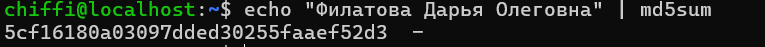

---

## 2. Особенности дистрибутива
### 2.1. Разработчик и поддержка
**Lubuntu** - официальная «лёгкая» версия Ubuntu, разрабатываемая сообществом Lubuntu при поддержке компании Canonical (создателя Ubuntu). Проект был основан в 2008 году, а первая стабильная версия (Lubuntu 10.04) вышла 2 мая 2010 года.

### 2.2. Базовый дистрибутив
Lubuntu является надстройкой над Ubuntu, который, в свою очередь, основан на Debian. Это означает, что Lubuntu наследует все репозитории и совместимость с пакетами Ubuntu.

### 2.3. Релизы
Lubuntu следует графику выпусков Ubuntu:
- LTS-версии (Long Term Support) - выходят раз в 2 года в апреле, поддерживаются 3 года
- Промежуточные версии — выходят каждые 6 месяцев (в апреле и октябре), поддерживаются 9 месяцев

    | Версия | Дата | Статус | Ключевое изменение |
    |--------|------|--------|-------------------|
    | 10.04 | 02.05.2010 | Завершён | Первый стабильный выпуск |
    | 11.10 | 13.10.2011 | Завершён | Официальный статус в Ubuntu |
    | 14.04 LTS | 17.04.2014 | Завершён | Первая LTS-версия |
    | 18.10 | 18.10.2018 | Завершён | Переход на LXQt |
    | 20.04 LTS | 23.04.2020 | Завершён | Первая LTS с LXQt |
    |22.04 LTS | 21.04.2022	| Завершён | LXQt |
    | **24.04 LTS** | **25.04.2024** | **Активная** | **Используется в работе** |
    | 26.04 LTS | 23.04.2026 | Активная | LXQt 2.3 |

Для выполнения лабораторной работы установлена версия **Lubuntu 24.04.4 LTS** с кодовым именем «Noble Numbat»
- Выпущена: 25 апреля 2024 года
- Поддержка до: апреля 2027 года
- Рабочий стол: LXQt 1.4.0

### 2.4. Ресурсы для изучения

| Ресурс | Ссылка | Язык | Описание |
|--------|--------|------|----------|
| Официальный сайт Lubuntu | https://lubuntu.me | Английский | Новости, анонсы, загрузка образов |
| Официальное руководство | https://manual.lubuntu.me | Английский | Полная документация по установке и настройке |
| Wiki Lubuntu | https://wiki.ubuntu.com/Lubuntu | Английский | Техническая документация |
| Русскоязычный форум Ubuntu | https://ubuntu.ru/forum | Русский | Помощь на русском языке |
| Ask Ubuntu | https://askubuntu.com | Английский | База знаний по Ubuntu и официальным производным |
| Reddit (r/lubuntu) | https://reddit.com/r/lubuntu | Английский | Обсуждения и новости сообщества |

### 2.5. Пакетный менеджер
Lubuntu использует **APT** (Advanced Packaging Tool) - стандартный пакетный менеджер всех Ubuntu-подобных дистрибутивов. Для работы с пакетами также доступны графические обёртки: **Discover** (в новых версиях) и **Synaptic** (в старых)

| Операция | Команда | Описание |
|----------|---------|----------|
| Обновление списка пакетов | `sudo apt update` | Обновляет информацию о доступных пакетах |
| Поиск пакета | `apt search имя пакета` | Ищет пакет по имени или описанию |
| Информация о пакете | `apt show имя пакета` | Показывает подробную информацию о пакете |
| Установка пакета | `sudo apt install имя пакета` | Устанавливает пакет и его зависимости |
| Обновление всех пакетов | `sudo apt upgrade` | Обновляет установленные пакеты |
| Удаление пакета | `sudo apt remove имя пакета` | Удаляет пакет, оставляя конфигурационные файлы |
| Полное удаление пакета | `sudo apt purge имя пакета` | Удаляет пакет вместе с конфигурационными файлами |

### 2.6. Как происходит процесс установки
Установка Lubuntu, как и любого другого дистрибутива Linux, в общем виде происходит в несколько этапов:
- **Подготовка носителя**: Скачать ISO-образ с официального сайта
- **Загрузка установщика**: Запустить компьютер (или виртуальную машину) с этого образа. Появится окно, где можно выбрать язык, запустить установку или просто попробовать систему без установки
- **Выбор параметров**: Запускается графический установщик. Пользователь последовательно задаёт:
    + язык интерфейса системы
    + часовой пояс
    + раскладку клавиатуры
- **Работа с диском**: На этом этапе пользователь выбирает, на какой диск и каким образом будет установлена система
- **Создание пользователя**: Установщик запрашивает данные для первого пользователя:
    + имя (логин)
    + имя компьютера (hostname)
    + пароль
- **Завершение установки**: Система копирует файлы на жёсткий диск. После завершения копирования установщик предлагает перезагрузить компьютер. При загрузке с установленного на диск носителя (после перезагрузки) пользователь видит экран входа в систему

Для установки Lubuntu достаточно следовать **инструкциям официального руководства** (https://manual.lubuntu.me) или **стандартным гайдам по установке Ubuntu**, так как процесс идентичен. Специфических документов для Lubuntu не требуется

### 2.7. Минимальные системные требования
**Lubuntu 24.04 LTS**

| Компонент | Минимальные | Рекомендуемые |
|-----------|-------------|---------------|
| **Процессор** | 1 ГГц | 2 ГГц (двухъядерный) |
| **Оперативная память** | 1 ГБ | 2 ГБ |
| **Место на диске** | 8 ГБ | 20 ГБ и более |
| **Графика** | 1024×768 | любая с 3D-ускорением |

**LXQt** (оконный менеджер)

| Компонент | Минимальные |
|-----------|-------------|
| **Процессор** | от 1 ГГц |
| **Оперативная память** | от 512 МБ |

LXQt очень легковесный, поэтому он отлично работает даже на слабом оборудовании

---

## 3. Установка ОС

### 3.1. Создание виртуальной машины

В программе VirtualBox была создана виртуальная машина со следующими параметрами:

| Параметр | Значение |
|----------|----------|
| Имя | Lubuntu |
| Тип ОС | Linux |
| Дистрибутив ОС | Ubuntu |
| Версия | Ubuntu 24.04 LTS (noble Numbat) (64-bit) |
| Оперативная память | 2048 МБ (2 ГБ) |
| Процессоры | 2 |
| Жёсткий диск | 25 ГБ |
| Сетевой адаптер | NAT |

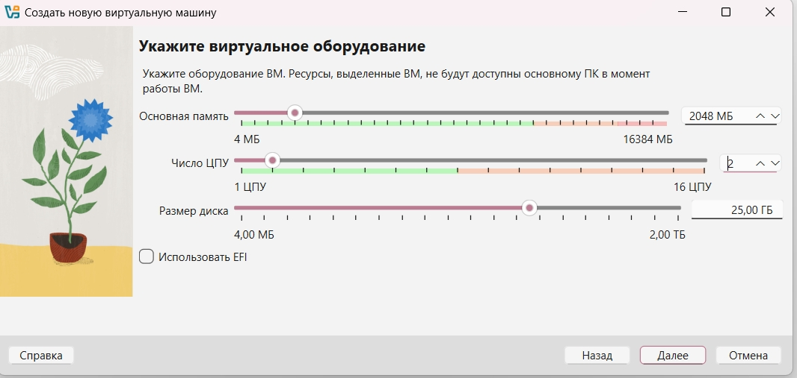
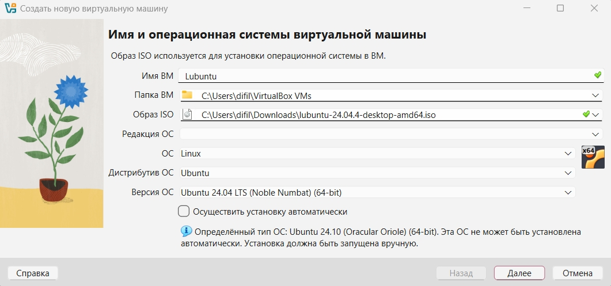
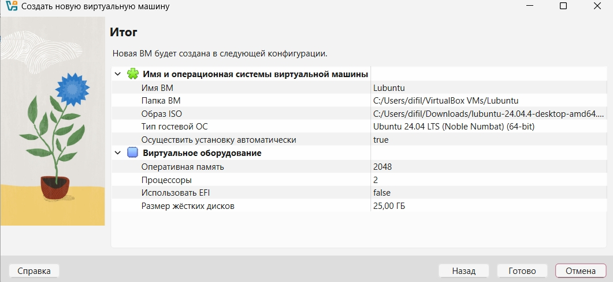

### 3.2. Загрузка образа

ISO-образ Lubuntu был скачан с официального сайта:

- **Версия:** Lubuntu 24.04.4 LTS
- **Кодовое имя:** Noble Numbat
- **Размер:** примерно 3.2 ГБ
- **Архитектура:** amd64 (64-bit)


### 3.3. Установка Lubuntu на виртуальную машину

Установка проводилась через графический установщик:

1. **Загрузка с ISO** — виртуальная машина запущена с подключённого образа
2. **Выбор языка** — русский
3. **Запуск установки** — выбран пункт `Install Lubuntu`
4. **Раскладка клавиатуры** — Russian
5. **Часовой пояс** — Europe/Moscow
6. **Разметка диска** — выбран вариант `Стереть диск и установить Lubuntu`
7. **Создание пользователя**:
   - Имя: Chiffi
   - Имя компьютера: _
   - Пароль
8. **Завершение установки** — система скопировала файлы и предложила перезагрузиться

### 3.4. Проверка доступности ОС после перезагрузки

После перезагрузки виртуальной машины появился экран входа в систему. Ввод пароля, заданного при установке, предоставил доступ к рабочему столу Lubuntu. Система загружается и работает корректно

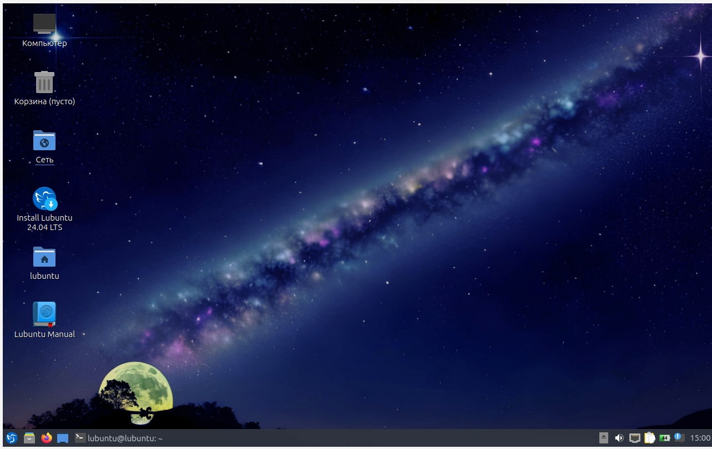

---

## 4. Настройка и установка пакетов

### 4.1. Возможность открывать несколько программ (окон), переключаться между ними

В Lubuntu используется оконный менеджер LXQt. Открыть несколько программ можно через меню приложений (значок в левом нижнем углу). Переключение между окнами осуществляется:

- Кликом по кнопке программы на **панели задач** (внизу экрана)
- Комбинацией клавиш **Alt + Tab**


### 4.2. Отслеживание системных ресурсов, управление процессами

Для мониторинга системы установлен пакет **htop**:

```bash
sudo apt update
sudo apt install htop -y
```

Что можно увидеь после запуска **htop** в терминале:
- загрузку каждого ядра ЦП
- использование оперативной памяти
- список процессов
- возможность завершить процесс (клавиша F9)

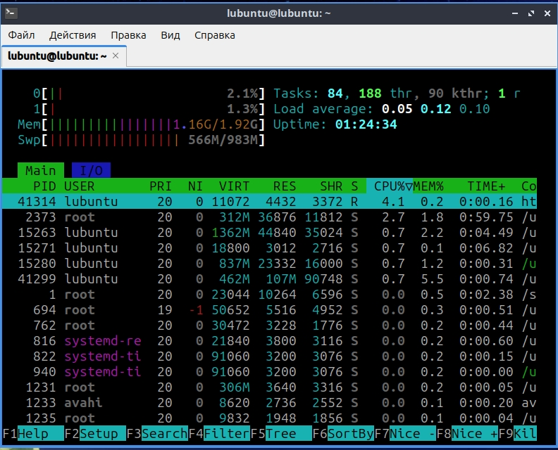

### 4.3. Настройка логина/пароля пользователя, блокировка экрана
При установке системы был создан пользователь с паролем.

**Блокировка экрана:** Иконка пользователя в правом нижнем углу -> Заблокировать экран

**Смена пароля:** Иконка пользователя в правом нижнем углу -> Параметры -> Настройки LXQt -> Пользователи и группы

### 4.4. Настройка сетевых подключений

Управление сетью в Lubuntu осуществляется через **Network Manager**

**Как настроено подключение:**
При установке VirtualBox сетевые драйверы были отключены, чтобы избежать конфликта с интернетом на основном ПК. Несмотря на это, интернет внутри виртуальной машины работает через режим **NAT**, используя подключение основного ноутбука к обычной Wi-Fi сети

**Графический интерфейс:**
Чтобы посмотреть или изменить настройки сети, нужно кликнуть по значку сети в правом нижнем углу экрана и выбрать «Настройки сети». В открывшемся окне можно увидеть активные подключения, включить или выключить сеть, а также настроить VPN

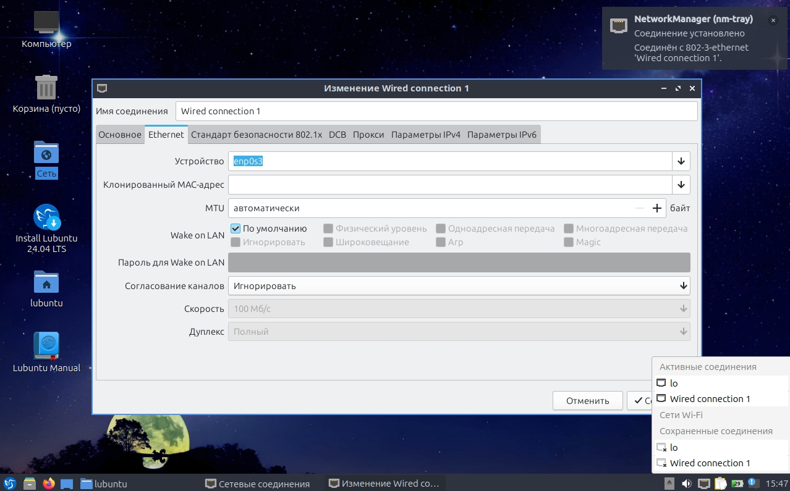

### 4.5. Работа с файловой системой (файловый менеджер)
В Lubuntu используется лёгкий и быстрый файловый менеджер **PCManFM-Qt**. Его можно открыть через иконку «Компьютер» на рабочем столе или через меню приложений

Основные возможности:
- Навигация по файловой системе
- Создание, удаление, переименование файлов и папок
- Копирование и перемещение (Ctrl+C, Ctrl+V)
- Просмотр свойств файлов (правая кнопка мыши -> Свойства)
- Поиск файлов

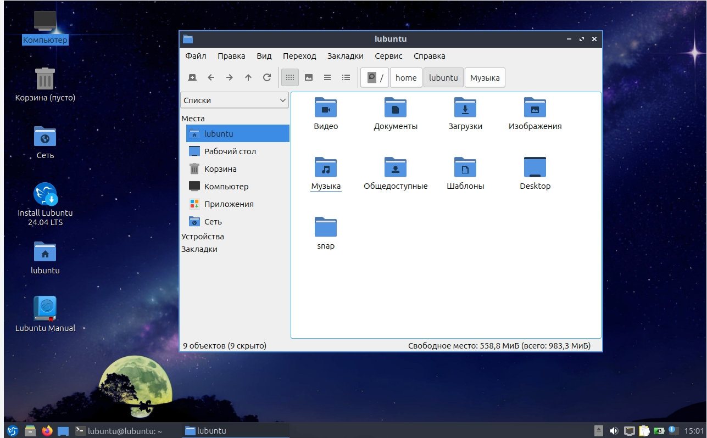

### 4.6. Выход в интернет (браузер)
В Lubuntu установлен браузер **Firefox**. Его можно открыть через меню -> Интернет -> Firefox

Браузер успешно открывает веб-страницы, поддерживает вкладки, закладки и расширения. Интернет внутри виртуальной машины работает через NAT

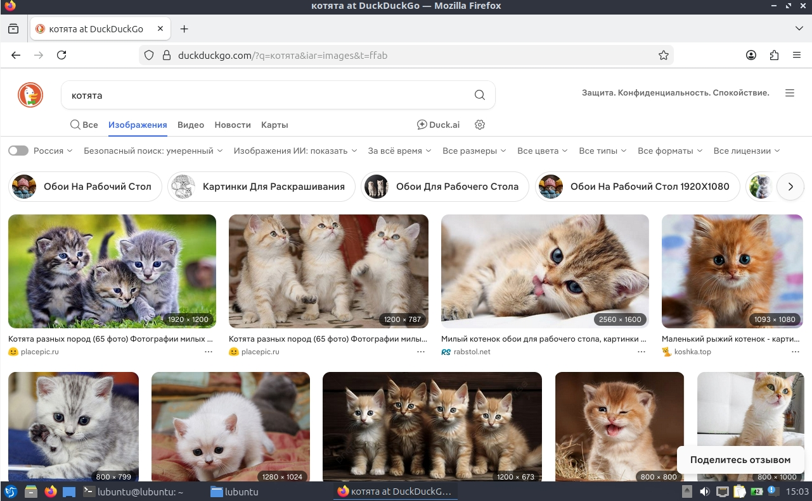

### 4.7. Инструменты для разработки
Для разработки установлен пакет **build-essential**, который включает компиляторы C/C++ (gcc, g++), утилиту make и другие необходимые инструменты

```bash
sudo apt install build-essential -y
```

Проверка версии компилятора:

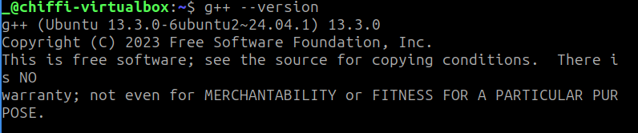

Пример компиляции и запуска программы на C++:
```bash
nano lab4.cpp
```

Содержимое файла:
```bash
#include <iostream>

int main() {
    std::cout << "lab4 выполнена!" << std::endl;
    return 0;
}
```

Компиляция и запуск:
```bash
g++ lab4.cpp -o lab4
./lab4
```

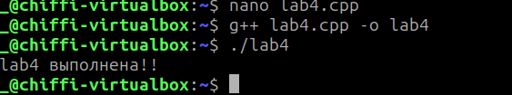