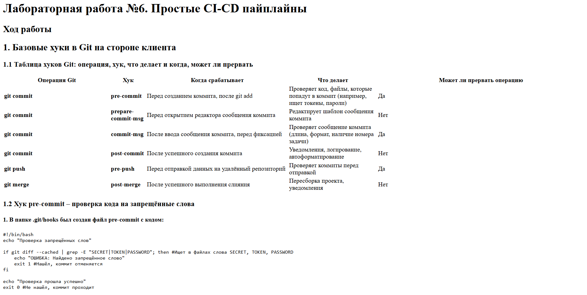

# Лабораторная работа №6. Простые CI-CD пайплайны

## Ход работы

## 1. Базовые хуки в Git на стороне клиента

### 1.1. Таблица хуков Git: операция, хук, что делает и когда, может ли прервать

| Операция Git | Хук | Когда срабатывает | Что делает | Может ли прервать операцию |
|--------------|-----|-------------------|------------|---------------------------|
| **git commit** | **pre-commit** | Перед созданием коммита, после git add | Проверяет код, файлы, которые попадут в коммит (например, ищет токены, пароли) | Да |
| **git commit** | **prepare-commit-msg** | Перед открытием редактора сообщения коммита | Редактирует шаблон сообщения коммита | Нет |
| **git commit** | **commit-msg** | После ввода сообщения коммита, перед фиксацией | Проверяет сообщение коммита (длина, формат, наличие номера задачи) | Да |
| **git commit** | **post-commit** | После успешного создания коммита | Уведомления, логирование, автоформатирование | Нет |
| **git push** | **pre-push** | Перед отправкой данных на удалённый репозиторий | Проверяет коммиты перед отправкой | Да |
| **git merge** | **post-merge** | После успешного выполнения слияния | Пересборка проекта, уведомления | Нет |

### 1.2. Хук pre-commit – проверка кода на запрещённые слова

#### 1.2.1. В папке .git/hooks был создан файл **pre-commit** с кодом:
```bash
#!/bin/bash
echo "Проверка запрещённых слов"

if git diff --cached | grep -E "||"; then #Ищет в файлах слова
    echo "ОШИБКА: Найдено запрещённое слово"
    exit 1 #Нашёл, коммит отменяется
fi

echo "Проверка прошла успешно"
exit 0 #Не нашёл, коммит проходит
```
#### 1.2.2. После этого в терминале VS Code была выполнена команда для того, чтобы файл стал исполняемым:
```bash
chmod +x .git/hooks/pre-commit
```
#### 1.2.3.  Проверка работы хука:

Был создан тестовый файл с запрещённым словом:

```bash
echo "my password" > test.txt
git add test.txt
git commit -m "test commit"
```
Вывод терминала:

```bash
Проверка запрещённых слов
my password
ОШИБКА: Найдено запрещённое слово
```
*Результат:* коммит не создался – хук сработал и прервал операцию

### 1.3. Хук commit-msg – проверка длины сообщения коммита

#### 1.3.1. В папке .git/hooks был создан файл **commit-msg** с кодом:
```bash
#!/bin/bash
echo "Проверка длины сообщения коммита"

MSG=$(cat "$1") #Читаем сообщение коммита из временного файла и сохраняем в переменную MSG

if [ ${#MSG} -lt 5 ]; then #Проверяем, меньше ли длина сообщения 5 символов
    echo "ОШИБКА: Сообщение слишком короткое (нужно минимум 5 символов)"
    exit 1 #< 5, коммит отменяется
fi

echo "Проверка прошла успешно"
exit 0 #Длина >= 5, коммит проходит
```
#### 1.3.2. После этого в терминале VS Code была выполнена команда для того, чтобы файл стал исполняемым:
```bash
chmod +x .git/hooks/commit-msg
```
#### 1.3.3.  Проверка работы хука:

Была совершена попытка создать коммит с сообщением длиной меньше 5:

```bash
git commit --allow-empty -m "ab"
```
Вывод терминала:

```bash
Проверка длины сообщения коммита
ОШИБКА: Сообщение слишком короткое (нужно минимум 5 символов)
```
*Результат:* коммит не создался – хук сработал и прервал операцию

---

## 2. Хуки Git на стороне сервера

### 2.1. Для эмуляции удалённого сервера была создана **bare-копия репозитория**:

```bash
cd ~
mkdir server_repo.git
cd server_repo.git
git init --bare
```

### 2.2. В основном репозитории был добавлен **remote local-server**:

```bash
cd /mnt/c/Users/difil/git_labs
git remote add local-server /mnt/c/Users/difil/server_repo.git
```

### 2.3. Для автоматической конвертации отчёта из Markdown в HTML была установлена утилита **pandoc**:

```bash
sudo apt install pandoc -y
pandoc --version
pandoc 3.1.3
```

### 2.4. В папке hooks серверной копии создан файл **post-receive**:

```bash
cd /mnt/c/Users/difil/server_repo.git/hooks
nano post-receive
```

Содержимое файла:

```bash
#!/bin/bash
echo "Генерация HTML из Markdown"

WORK_DIR=/tmp/server_worktree
BRANCH="lab6-report"

mkdir -p $WORK_DIR
git --work-tree=$WORK_DIR --git-dir=/mnt/c/Users/difil/server_repo.git checkout $BRANCH -f

if [ -f "$WORK_DIR/reports/lab6.md" ]; then
    /usr/bin/pandoc "$WORK_DIR/reports/lab6.md" -o "$WORK_DIR/reports/lab6.html"
    echo "HTML создан: $WORK_DIR/reports/lab6.html"
else
    echo "Файл reports/lab6.md не найден в ветке $BRANCH"
fi
```

### 2.5. После этого была выполнена команда для того, чтобы файл стал исполняемым:
 
 ```bash
 chmod +x /mnt/c/Users/difil/server_repo.git/hooks/post-receive
 ```

### 2.6. Проверка работы хука
 В основном репозитории был создан файл **reports/lab6.md**, после чего было соверено добавление в Git и отправка на сервер:
 
 ```bash
 git add reports/lab6.md
 git commit -m "add lab6.md in reports"
 git push local-server lab6-report
 ```
 Вывод терминала:
 ```bash
 remote:  Генерация HTML из Markdown 
 remote: Already on 'lab6-report'
 remote:  HTML создан: /tmp/server_worktree/reports/lab6.html
 To /mnt/c/Users/difil/server_repo.git
    201562d..3e0747c  lab6-report -> lab6-report
 ```

### 2.7. Проверка обновления HTML при изменении отчёта
 При последующем изменении lab6.md и новом push хук автоматически пересоздаёт HTML.
 

---

## 3. Сборка с помощью CMake

**CMake** — это кроссплатформенная система управления, настройки и автоматизации сборки программного обеспечения из исходного кода. Она не компилирует код напрямую, а генерирует файлы сборки для конкретной операционной системы.


### 3.1. Установка CMake

CMake был установлен в WSL:

```bash
sudo apt install cmake -y
cmake --version
cmake version 3.28.3
```

### 3.2. Основные понятия CMake

| Понятие | Описание | Пример команды |
|---------|----------|----------------|
| **Project** | Определяет название и версию проекта | `project(MyProject VERSION 1.0)` |
| **Target** | Цель сборки (исполняемый файл или библиотека) | `add_executable(app main.cpp)` |
| **Executable** | Исполняемый файл — программа, которую можно запустить | `add_executable(myapp main.cpp)` |
| **Library** | Библиотека — набор функций для подключения к программе | `add_library(mylib STATIC mylib.cpp)` |
| **Linking** | Связывание — подключение библиотеки к исполняемому файлу | `target_link_libraries(myapp mylib)` |
| **Include Directories** | Директории для поиска заголовочных файлов | `target_include_directories(mylib PUBLIC include)` |
| **Subdirectory** | Поддиректория — добавление папки со своим CMakeLists.txt | `add_subdirectory(tests)` |
| **CTest** | Система тестирования в CMake | `enable_testing()` + `add_test()` |

### 3.3. Перепись цели сборки второй лабораторной работы по "Структурам данных" c Make на CMake

#### 3.3.1. Главный CMakeLists.txt

```bash
cmake_minimum_required(VERSION 3.10)
project(Lab2 VERSION 1.0)

set(CMAKE_CXX_STANDARD 17)
set(CMAKE_CXX_STANDARD_REQUIRED ON)

set(SOURCES_DIR ${CMAKE_CURRENT_SOURCE_DIR}/src)

set(LIB_SOURCES
    ${SOURCES_DIR}/mystring.cpp
    ${SOURCES_DIR}/basefile.cpp
    ${SOURCES_DIR}/base32file.cpp
    ${SOURCES_DIR}/rlefile.cpp
    ${SOURCES_DIR}/base32file2.cpp
    ${SOURCES_DIR}/rlefile2.cpp
)

add_library(core STATIC ${LIB_SOURCES})
target_include_directories(core PUBLIC ${SOURCES_DIR})

add_executable(lab2 ${SOURCES_DIR}/lab2.cpp)
target_link_libraries(lab2 core)

add_subdirectory(tests)
```
#### 3.3.2. CMakeLists.txt в папке tests/

```bash
enable_testing()

set(TEST_FILES
    test_basefile
    test_base32file
    test_rlefile
    test_base32file2
    test_rlefile2
    test_composition
)

foreach(TEST ${TEST_FILES})
    add_executable(${TEST} ${CMAKE_CURRENT_SOURCE_DIR}/${TEST}.cpp)
    target_link_libraries(${TEST} core)
    add_test(NAME ${TEST} COMMAND ${TEST})
endforeach()

```

### 3.4. Сборка проекта и запуск тестов

#### 3.4.1. Сборка проекта

```bash
cd /mnt/c/Users/difil/git_labs/labs/lab2/build
cmake ..
cmake --build .
```
где:
- `cmake ..`	Читает CMakeLists.txt и создаёт Makefile (генерирует систему сборки)
- `cmake --build .`	Запускает сборку (компилирует код, создаёт программу и библиотеки)

Результат сборки: 

```bash
[ 33%] Built target core
[ 42%] Built target lab2
[ 52%] Built target test_basefile
[ 61%] Built target test_base32file
[ 71%] Built target test_rlefile
[ 80%] Built target test_base32file2
[ 90%] Built target test_rlefile2
[100%] Built target test_composition
```

#### 3.4.2. Запуск тестов

Для запуска тестов используется **CTest**. Тесты расположены в папке build/tests/, однако для их корректной работы необходима папка data. Поскольку тесты запускаются из build/tests/ и ожидают data в текущей директории, была создана ссылка:

```bash
cd /mnt/c/Users/difil/git_labs/labs/lab2/build/tests
ln -s ../../data data
```
Запуск CTest:
```bash
cd /mnt/c/Users/difil/git_labs/labs/lab2/build/tests
ctest --output-on-failure
```
Вывод терминала:
```bash
    Start 1: test_basefile
1/6 Test #1: test_basefile ....................   Passed    0.01 sec
    Start 2: test_base32file
2/6 Test #2: test_base32file ..................   Passed    0.02 sec
    Start 3: test_rlefile
3/6 Test #3: test_rlefile .....................   Passed    0.01 sec
    Start 4: test_base32file2
4/6 Test #4: test_base32file2 .................   Passed    0.01 sec
    Start 5: test_rlefile2
5/6 Test #5: test_rlefile2 ....................   Passed    0.01 sec
    Start 6: test_composition
6/6 Test #6: test_composition .................   Passed    0.02 sec

100% tests passed, 0 tests failed out of 6

Total Test time (real) =   0.09 sec
```

---

## 4. Автоматизация задач CMake в git

Была создана новая ветка **dev**

### 4.1. Настройка хука pre-commit

Был создан объединённый хук **pre-commit**, который:

- Проверяет наличие запрещённых слов (SECRET, TOKEN, PASSWORD)
- Если текущая ветка dev, запускает тесты CMake и отменяет коммит при их падении

Код **pre-commit**:

```bash
#!/bin/bash

echo "Проверка запрещённых слов"

if git diff --cached | grep -E "SECRET|TOKEN|PASSWORD"; then #Ищет в файлах слова SECRET, TOKEN, PASSWORD
    echo "ОШИБКА: Найдено запрещённое слово"
    exit 1 #Нашёл, коммит отменяется
fi

echo "Проверка прошла успешно"

# Тесты CMake (только для ветки dev)
echo ""
echo "Проверка тестов CMake"

BRANCH=$(git rev-parse --abbrev-ref HEAD)

if [ "$BRANCH" = "dev" ]; then
    echo "      Ветка dev, запускаем тесты"
    
    cd /mnt/c/Users/difil/git_labs/labs/lab2/build/tests
    ctest --output-on-failure
    
    if [ $? -ne 0 ]; then
        echo ""
        echo "Тесты не пройдены! Коммит отменен."
        exit 1
    fi
    echo "Тесты пройдены"
else
    echo "Ветка $BRANCH, пропускаем тесты"
fi

echo ""
echo "PRE-COMMIT: ВСЕ ПРОВЕРКИ ПРОЙДЕНЫ"
exit 0
```

После этого была выполнена команда для того, чтобы файл стал исполняемым:
 
 ```bash
chmod +x .git/hooks/pre-commit
```

### 4.2. Проверка работы хука на обычном коммите в dev

```bash
chiffi@localhost:/mnt/c/Users/difil/git_labs$ echo "// test commit on dev" >> labs/lab2/src/lab2.cpp
chiffi@localhost:/mnt/c/Users/difil/git_labs$ git add labs/lab2/src/lab2.cpp
chiffi@localhost:/mnt/c/Users/difil/git_labs$ git commit -m "test: regular commit on dev"
Проверка запрещённых слов
Проверка прошла успешно

Проверка тестов CMake
      Ветка dev, запускаем тесты
Test project /mnt/c/Users/difil/git_labs/labs/lab2/build/tests
    Start 1: test_basefile
1/6 Test #1: test_basefile ....................   Passed    0.02 sec
    Start 2: test_base32file
2/6 Test #2: test_base32file ..................   Passed    0.05 sec
    Start 3: test_rlefile
3/6 Test #3: test_rlefile .....................   Passed    0.03 sec
    Start 4: test_base32file2
4/6 Test #4: test_base32file2 .................   Passed    0.05 sec
    Start 5: test_rlefile2
5/6 Test #5: test_rlefile2 ....................   Passed    0.06 sec
    Start 6: test_composition
6/6 Test #6: test_composition .................   Passed    0.10 sec

100% tests passed, 0 tests failed out of 6

Total Test time (real) =   0.45 sec
Тесты пройдены

PRE-COMMIT: ВСЕ ПРОВЕРКИ ПРОЙДЕНЫ
```

### 4.3. Проверка работы хука при merge

```bash
git checkout -b merge-branch
echo "// merge branch" >> labs/lab2/src/lab2.cpp
git add labs/lab2/src/lab2.cpp
git commit -m "commit for merge"
git checkout dev
git merge merge-branch --no-ff -m "merge branch for lab"
```

После создания merge-коммита были запущены тесты:

```bash
cd labs/lab2/build/tests
ctest --output-on-failure
```

Вывод терминала:
```bash
Test project /mnt/c/Users/difil/git_labs/labs/lab2/build/tests
    Start 1: test_basefile
1/6 Test #1: test_basefile ....................   Passed    0.02 sec
    Start 2: test_base32file
2/6 Test #2: test_base32file ..................   Passed    0.05 sec
    Start 3: test_rlefile
3/6 Test #3: test_rlefile .....................   Passed    0.03 sec
    Start 4: test_composition
4/6 Test #4: test_composition .................   Passed    0.04 sec
    Start 5: test_base32file2
5/6 Test #5: test_base32file2 .................   Passed    0.04 sec
    Start 6: test_rlefile2
6/6 Test #6: test_rlefile2 ....................   Passed    0.03 sec

100% tests passed, 0 tests failed out of 6
```
*Результат:* после merge все тесты успешно пройдены

### 4.4. Настройка хука post-commit для сборки библиотеки