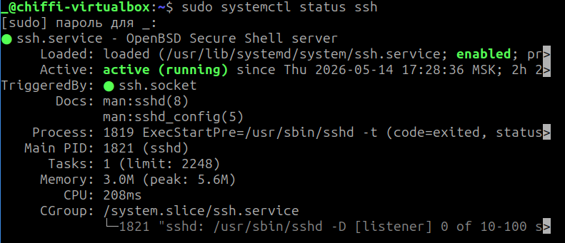
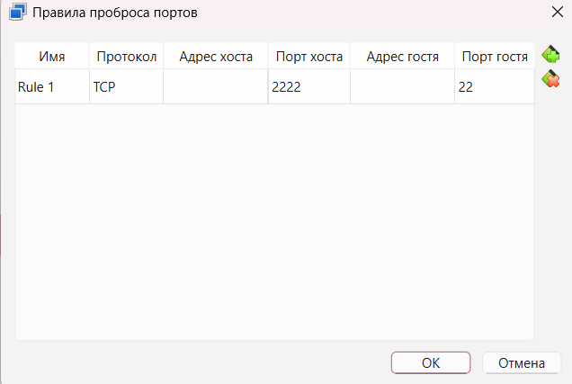
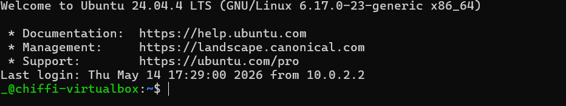

# Лабораторная работа №7. Развертывание на целевой машине

## Ход работы

## 1. Создание виртуальной машины

### 1.1. Используемая виртуальная машина
Для подготовки целевой машины использовалась **виртуальная машина, созданная в лабораторной работе №4**. Её параметры:

| Параметр | Значение |
|----------|----------|
| Платформа | Oracle VirtualBox 7.2.8 |
| Дистрибутив | Lubuntu 24.04 LTS (в соответствии с вариантом 5) |
| Оперативная память | 2048 МБ |
| Процессоры | 2 |
| Жёсткий диск | 25 ГБ |
| Сетевой режим | NAT |

### 1.2. Отключение графической среды

Поскольку лабораторная работа №7 не требует графического интерфейса (достаточно консольного доступа), было выполнено переключение на текстовую консоль без отключения графики полностью

**Способ переключения:** комбинация клавиш `Ctrl + Alt + F3`

После нажатия этой комбинации система переключилась на текстовую консоль, где появилось приглашение ввода логина. Графическая оболочка при этом продолжает работать в фоне на `Ctrl + Alt + F2`, но не используется в работе

### 1.3. потенциальные опасности наличия доступа внешнего человека к виртуальной машине

При предоставлении доступа другому человеку к виртуальной машине возникают следующие риски:

- **Чтение и изменение файлов** - пользователь может просматривать и редактировать файлы в своей домашней директории
- **Запуск вредоносного кода** - возможность выполнения любых команд на системе
- **Нагрузка на ресурсы** - запущенные процессы могут потреблять память и процессор
- **Распространение атак** - ВМ может быть использована для атак на другие узлы сети

**Меры безопасности, принятые в работе:**
- Использование SSH-ключей вместо пароля
- Отключение парольного доступа после настройки ключей
- Создание отдельного пользователя для напарника
- Временное открытие порта только на период выполнения работы

---

## 2. Настройка удалённого доступа

### 2.1. Установка SSH-клиента на основной системе
На основном компьютере (Windows) SSH-клиент уже встроен в PowerShell

### 2.2. Установка и настройка SSH-сервера на виртуальной машине

Внутри виртуальной машины выполнен установка OpenSSH-сервера:

```bash
sudo apt update
sudo apt install openssh-server -y
```
Проверка работы SSH-сервера:
```bash
sudo systemctl status ssh
```




### 2.3. Проброс портов в VirtualBox

**Что такое порт TCP:** Порт - это числовой идентификатор, который позволяет операционной системе направлять трафик конкретному приложению

**Проброс портов** - это механизм VirtualBox, который перенаправляет запросы с порта хост-системы на порт гостевой системы. Это необходимо, потому что виртуальная машина в режиме NAT скрыта за основным компьютером и недоступна извне

**Настройка проброса:**

1. Виртуальная машина выключена
2. В VirtualBox Manager выбрана ВМ -> **Настроить** -> **Сеть**
3. Адаптер 1: тип подключения **NAT**
4. Нажата кнопка **«Дополнительно»** -> **«Проброс портов»**
5. Добавлено правило:

| Имя | Протокол | Адрес хоста | Порт хоста | Адрес гостя | Порт гостя |
|-----|----------|-------------|------------|-------------|------------|
| SSH | TCP | пусто | 2222 | пусто | 22 |

**Почему такие значения:**

| Поле | Значение | Пояснение |
|------|----------|-----------|
| Порт хоста | 2222 | Порт на основном компьютере (выбран нестандартный, чтобы не конфликтовать с другими службами) |
| Порт гостя | 22 | Стандартный порт SSH внутри виртуальной машины |



### 2.4. Подключение по паролю

После настройки проброса портов проверено подключение к виртуальной машине из основной системы (Windows) с использованием пароля

В PowerShell выполнена команда:
```powershell
ssh -p 2222 _@127.0.0.1
```

После этого система запросила пароль пользователя _. После ввода пароля подключение успешно выполнено.



### 2.5. Как добавить публичный ключ для подключения без пароля

Чтобы подключиться к серверу по SSH без ввода пароля, нужно добавить свой **публичный ключ** на сервер в специальный файл

**Куда добавлять:**  
Файл `~/.ssh/authorized_keys` в домашней директории пользователя на сервере

**Как добавить:**  
1. Скопировать содержимое своего публичного ключа
2. На сервере выполнить:  
   ```bash
   mkdir -p ~/.ssh
   echo "скопированный_ключ" >> ~/.ssh/authorized_keys
   chmod 700 ~/.ssh
   chmod 600 ~/.ssh/authorized_keys
   ```

**Что означают права:**
- **700** на папку .ssh - только владелец может читать и заходить
- **600** на файл authorized_keys - только владелец может его читать и писать

### 2.6. Настройка подключения по SSH-ключу

После успешного подключения по паролю настроен вход по SSH-ключу

#### 2.6.1. Создание SSH-ключа на основном компьютере

На основном компьютере (Windows) в PowerShell выполнена команда для генерации новой пары ключей:
```powershell
ssh-keygen -t ed25519 -C "lab7-key" -f C:\Users\difil\.ssh\lab7_key
```

#### 2.6.2. Добавление публичного ключа на виртуальную машину
Публичный ключ скопирован на виртуальную машину. Для этого сначала получено содержимое ключа:
```powershell
type C:\Users\difil\.ssh\lab7_key.pub
```

Затем выполнено подключение к ВМ по SSH (с паролем) и добавление ключа:
```powershell
# Подключение к ВМ
ssh -p 2222 _@127.0.0.1

# Внутри виртуальной машины:
mkdir -p ~/.ssh
echo "sssh-ed25519 AAAAC3NzaC1lZDI1NTE5AAAAIOzQBquC6IqNzlf/P0LE/Ijojmk9lXq2EcX4VuNLhkaS lab7-key" >> ~/.ssh/authorized_keys
chmod 700 ~/.ssh
chmod 600 ~/.ssh/authorized_keys
exit
```

После добавления ключа выполнено подключение с его использованием:
```powershell
ssh -p 2222 -i C:\Users\difil\.ssh\lab7_key _@127.0.0.1
```

**Результат:** подключение выполнено без запроса пароля. Сразу появилось приглашение терминала

### 2.7. Отключение доступа по паролю

Для повышения безопасности SSH-сервера доступ по паролю был отключён. Теперь вход возможен только по SSH-ключу

#### 2.7.1. Редактирование конфигурационного файла

Открыт файл конфигурации SSH-сервера:
```bash
sudo nano /etc/ssh/sshd_config
```

В файле найдена строка **#PasswordAuthentication yes** и изменена на:
```bash
PasswordAuthentication no
```

#### 2.7.2. Проверка отключения доступа по паролю
Выполнена попытка подключения с принудительным использованием только пароля (без ключа):
```powershell
ssh -p 2222 -o PubkeyAuthentication=no _@127.0.0.1
```

**Результат:** подключение по паролю больше невозможно. При этом подключение с использованием ключа продолжает работать
```powershell
Permission denied (publickey)
```

## 3. Настройка сессии для другого пользователя

### 3.1. Создание пользователя для напарника

На виртуальной машине создан отдельный пользователь для напарника

**Команда для создания пользователя:**

```bash
sudo adduser dashka
```

**Что происходит при выполнении команды:**
1. Создаётся домашняя директория /home/dashka
2. Создаётся группа с тем же именем
3. Запрашивается пароль для нового пользователя
4. Запрашиваются дополнительные данные (можно пропустить, нажав Enter)

### 3.2. Получение публичного SSH-ключа напарника и добавление его на виртуальную машину
Для того чтобы напарник мог подключаться к виртуальной машине без пароля, он сгенерировал свою пару SSH-ключей на своём компьютере и прислал публичный ключ

```bash
# 1. Создание директории .ssh для пользователя dashka
sudo mkdir -p /home/dashka/.ssh

# 2. Добавление публичного ключа в файл authorized_keys
echo "ssh-ed25519 AAAAC3NzaC1lZDI1NTE5AAAAILal41PjsbX3+ePFGIFb4kC6Gv/sEA2OjjMxhIFIxLZR" | sudo tee -a /home/dashka/.ssh/authorized_keys

# 3. Установка правильных прав доступа
sudo chmod 700 /home/dashka/.ssh
sudo chmod 600 /home/dashka/.ssh/authorized_keys

# 4. Установка владельца (пользователь dashka и его группа)
sudo chown -R dashka:dashka /home/dashka/.ssh
```